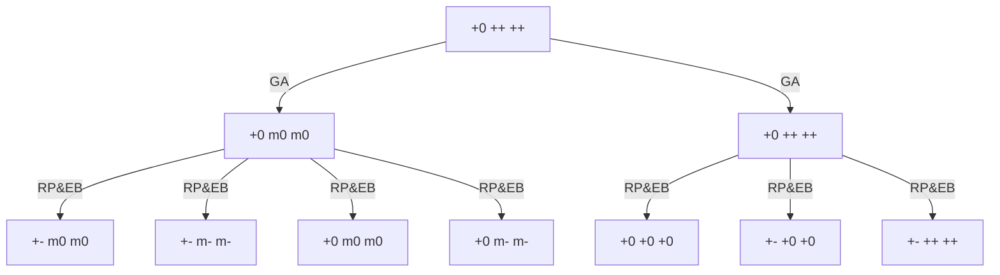

gradient applying(GA)

(strictly after)

exo behaviour(EB) | relation propagation(RP).  

> mapped parallelly, since at least in our case, these two affect different vars. So we can deal with them separately and product together. Or, we can do one after another, the order is not important.

(strictly after)
extreme derivative clip(EDC)

for example:

